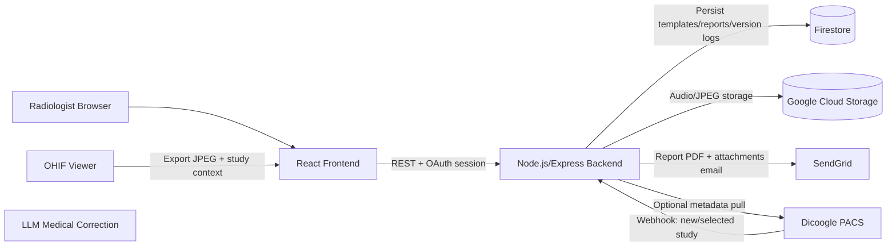

# Architecture Design

## High-level architecture diagram



## Key stack choices and reasons

- **Node.js + Express (backend):** lightweight, fast API iteration, ideal for Cloud Run/App Engine.
- **React + Quill (frontend):** strong UX for rich-text radiology reports and template authoring.
- **Firestore:** document model maps naturally to templates, reports, immutable versions.
- **GCS:** durable object storage for JPEG exports.
- **LLM (OpenAI/Gemini/Ollama):** AI-powered analysis and report assistance.
- **SendGrid:** robust transactional email delivery for report sharing workflows.
- **Google OAuth2 + session:** practical SSO and role control for radiologists.
- **Winston + GCP logging friendly JSON:** operational observability with HIPAA-compliant structured logging (service metadata, hostname, ISO 8601 timestamps).
- **HIPAA Audit Service:** SHA-256 hash-chained immutable audit trail for all PHI access, emergency break-glass access, compliance dashboard, 6-year retention.
- **HIPAA Middleware:** Automatic PHI route detection and logging, 15-minute session timeout, account lockout, HTTPS enforcement, password policy validation.

## Repository structure

```text
metupalle-jpg/tdai/
├── backend/
│   ├── src/
│   │   ├── config/
│   │   ├── middleware/
│   │   ├── routes/
│   │   ├── services/
│   │   └── server.ts
│   ├── tests/
│   ├── app.yaml
│   └── package.json
├── frontend/
│   ├── src/
│   │   ├── components/
│   │   ├── hooks/
│   │   └── App.tsx
│   └── package.json
├── shared/
│   └── src/types.ts
├── docs/
│   ├── architecture.md
│   └── deployment.md
├── integrations/
│   ├── ohif-export-plugin.ts
│   └── dicoogle-webhook.lua
├── scripts/
│   └── init-repo.sh
├── .github/workflows/deploy.yml
└── deploy.sh
```
